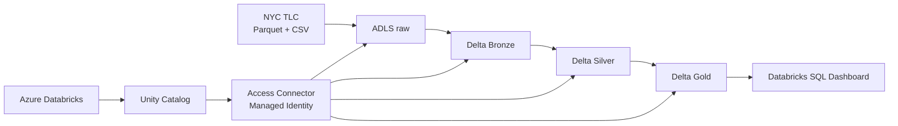

# Proyecto final: Ingeniería de datos con Azure Databricks

Pipeline medallion reproducible para analizar viajes de Yellow Taxi de NYC. La solución ingiere dos fuentes públicas, conserva los datos fuente en ADLS Gen2 y construye tablas Delta Bronze, Silver y Gold gobernadas por Unity Catalog.

## Arquitectura

## Recursos desplegados

| Recurso | Nombre | Región |
|---|---|---|
| Resource Group | `databrickscoursepy` | East US 2 |
| ADLS Gen2 | `stdatabrickspy2026` | East US 2 |
| Access Connector operativo | `ac-databrickspy2026-scus` | South Central US |
| Databricks Workspace operativo | `adb-databrickspy2026-scus` | South Central US |
| Unity Catalog | `databricks_course` | Workspace |

Contenedores: `raw`, `bronze`, `silver`, `gold`.

## Fuentes

1. Yellow Taxi Trip Records de enero de 2024, Parquet.
2. Taxi Zone Lookup, CSV.

Ambas fuentes son publicadas por NYC Taxi & Limousine Commission y están
incluidas en la carpeta [`datasets`](datasets/). Consulta
[`datasets/README.md`](datasets/README.md) para ver los enlaces oficiales, el
formato y la ruta de aterrizaje en ADLS.

## Ejecución

Ejecutar los notebooks en orden:

1. `PrepAmb/00_setup.sql`
2. `proceso/00_ingest_raw.py`
3. `proceso/01_bronze.py`
4. `proceso/02_silver.py`
5. `proceso/03_gold.py`
6. `proceso/04_quality_checks.py`
7. `seguridad/grants.sql`

El Job `nyc-taxi-medallion-pipeline` se ejecuta en Databricks Serverless. No se almacenan claves: ADLS se accede mediante Access Connector y Managed Identity.

Ejecución validada: `447409550489431` (`SUCCESS`), con reparación `271483939752289` después de adaptar Bronze a `_metadata.file_path` para Unity Catalog.

## Resultados Gold

- `databricks_course.gold.daily_kpis`
- `databricks_course.gold.zone_performance`
- `databricks_course.gold.payment_summary`

Las consultas del dashboard están en [dashboard/dashboard_queries.sql](dashboard/dashboard_queries.sql).

Dashboard publicado: [NYC Taxi Medallion Dashboard](https://adb-7405614164133876.16.azuredatabricks.net/sql/dashboardsv3/01f1bd2ff8f5132ea0451295da774a83/published?o=7405614164133876).

## Reversión

[reversion/drop_all.sql](reversion/drop_all.sql) elimina tablas y esquemas lógicos del proyecto. No elimina el Storage Account ni los archivos físicos, evitando pérdida accidental de datos.

## CI/CD

El workflow `.github/workflows/ci-cd.yml` valida Python y comprueba la
estructura del entregable. La ejecución manual despliega los notebooks de
`proceso` y ejecuta el Job de producción en Databricks Serverless.

Última ejecución de producción validada: [GitHub Actions #13](https://github.com/odraude667/databricks-app/actions/runs/36796002494).
